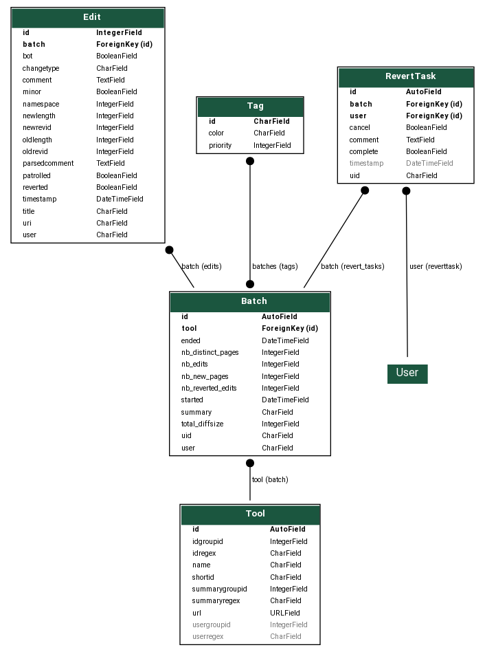

.. _page-architecture:

EditGroups' architecture
========================

EditGroups works by replicating some of the wiki's data in its own SQL database.
This makes it possible to have custom indices and quickly answer requests that would
be hard to handle using MediaWiki's API directly.

Data model
----------

The application works by listening to edits on the wiki, and matching them to
a set of known tools using regular expressions run on the edit summary.
If an edit matches one of the tools' regular expressions, then we can extract
a batch id (using the conventions of that tool) and store the edit's
metadata in our database, linking it to the corresponding batch.
Batch objects aggregate statistics about their edits and we keep this information
up to date as we insert edits.

Ingesting edits from the wiki
-----------------------------

The critical component of EditGroups is its listener, which reads the stream of 
all edits from the wiki and populates EditGroups' SQL database from it.

This is currently done using the WMF's `EventStream <https://wikitech.wikimedia.org/wiki/Event_Platform/EventStreams>`_.
This is a fairly reliable endpoint which also lets us resume the stream from a recent date if
ingestion stopped for some reason. By default, the listener tries to resume listening from the 
date of the latest edit it has ingested.

In the interest of running EditGroups on other Wikibase instances which do not have an associated EventStream
endpoint, it would be great to add the possibility on ingesting edits by polling the recent changes too.

